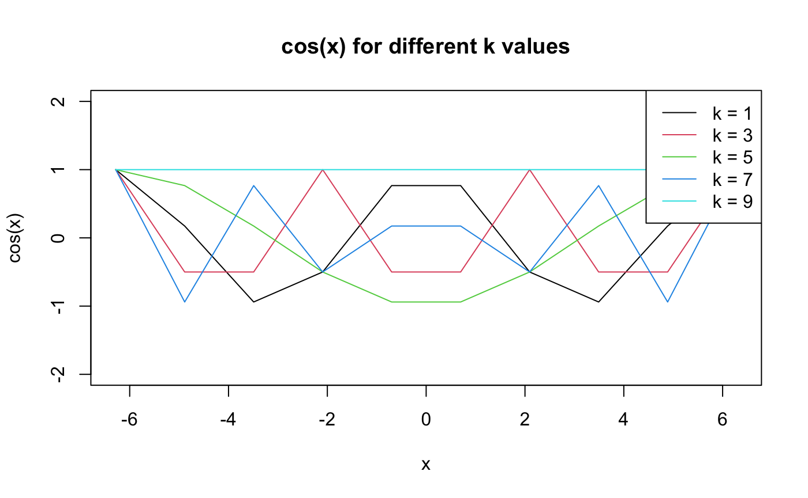
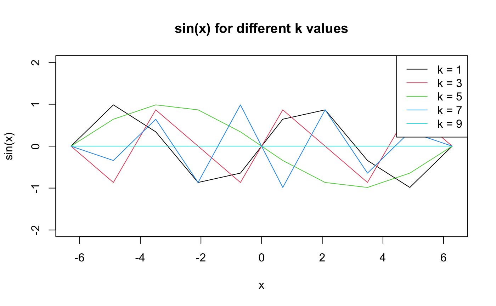

## Project2 Package

### Website basics
- Customized `pkgdown` components:
  - Changed the website theme to `morph` and navigation bar height to 100 pixels.
  - Added table of contents to the side bar.
  - Specified a font for code and set primary color theme.
  - Reordered and removed elements in the navigation bar.
  - Added website designer to the footnote.


##### Package & website creation:
- Michael Ramirez <mramir34@jhu.edu>

### Package description

`Project2` (Project 2: Create an R Package) contains basic functions for simple analysis. 

### Functions

| Function Name               | Description                                                               |
|-----------------------------|---------------------------------------------------------------------------|
| 'fn_cos'               | Calculate cosine by using a vector and k              |
| 'fn_sin'               | Calculate cosine by using a vector and k              |
| 'sample_mean'               | Calculate the mean of a vector             |
| 'sample_sd'               | Calculate the standard deviation of a vector             |
| 'CI1'               | Calculate the 95% confidence interval of a vector              |
| 'CI2'               | Calculate the 95% confidence interval of a S3 class vector              |


### Examples
##### `fn_cos`: Calculating and comparing fn_cos & cos

```r
## Compute and compare fn_cos() and cos()
## x = the number to be transformed 
## k = number of terms to be used in the series expansion beyond the constant 1
## Example: x is the number to be transformed with a total number of k terms to be used in the series expansion for cos.

x <- seq(-2 * pi, 2 * pi, length.out = 10)
k <- c(1, 3, 5, 7, 9)

## fn_cos() function applied to x and k
cos_y1 <- sapply(k, function(k) sapply(x, function(x) fn_cos(x, k)))
## fn_cos() plot for each k 
matplot(x, cos_y1, type = "l", lty = 1, col = 1:length(k),
        xlab = "x", ylab = "fn_cos(x)",
        main = "fn_cos(x) for different k values",
        xlim = c(-2 * pi, 2 * pi), ylim = c(-2, 2))
legend("topright", legend = paste("k =", k), col = 1:length(k), lty = 1)
}

## cos() function applied to x and k
cos_y2 <- sapply(k, function(k_val) cos(x * k_val))
## cos() plot for each k
matplot(x, cos_y2, type = "l", lty = 1, col = 1:length(k),
        xlab = "x", ylab = "cos(x)",
        main = "cos(x) for different k values",
        xlim = c(-2 * pi, 2 * pi), ylim = c(-2, 2))
legend("topright", legend = paste("k =", k), col = 1:length(k), lty = 1)
```




##### `fn_sin`: Calculating and comparing fn_sin & sin

```r
## Compute and compare fn_sin() and sin()
## x = the number to be transformed 
## k = number of terms to be used in the series expansion beyond the constant 1
## Example: x is the number to be transformed with a total number of k terms to be used in the series expansion for sine.

x <- seq(-2 * pi, 2 * pi, length.out = 10)
k <- c(1, 3, 5, 7, 9)

## fn_sin() function applied to x and k
sin_y1 <- sapply(k, function(k) sapply(x, function(x) fn_sin(x, k)))
## fn_sin() plot for each k 
matplot(x, sin_y1, type = "l", lty = 1, col = 1:length(k),
        xlab = "x", ylab = "fn_sin(x)",
        main = "fn_sin(x) for different k values",
        xlim = c(-2 * pi, 2 * pi), ylim = c(-2, 2))
legend("topright", legend = paste("k =", k), col = 1:length(k), lty = 1)

## sin() function applied to x and k
sin_y2 <- sapply(k, function(k_val) sin(x * k_val))
## sin() plot for each k 
matplot(x, sin_y2, type = "l", lty = 1, col = 1:length(k),
        xlab = "x", ylab = "sin(x)",
        main = "sin(x) for different k values",
        xlim = c(-2 * pi, 2 * pi), ylim = c(-2, 2))
legend("topright", legend = paste("k =", k), col = 1:length(k), lty = 1)
```


